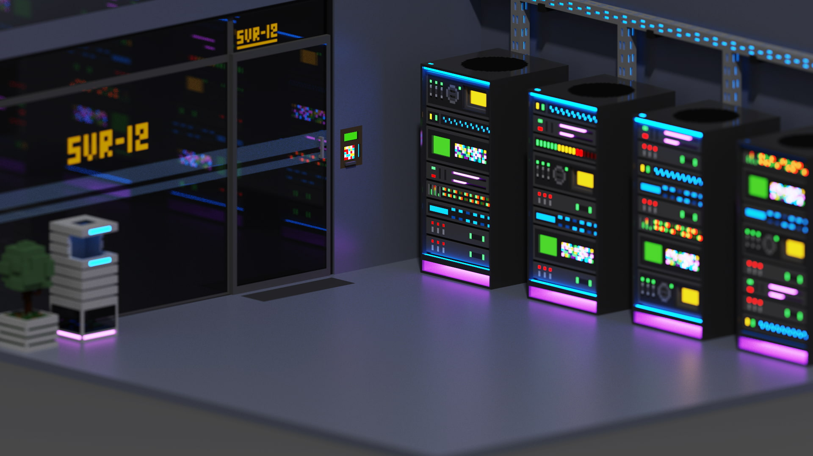

# 👋 Hi there!

I'm a fullstack developer who enjoys creating cool, useful, and fun stuff.  

### My Favorite Technologies

<!-- 

  
  

 -->

### Other Technologies I Work With  

...

### Interests 🤓☝️
💻 Homelab & Self-Hosting  
🛠️ DIY Tech, Arduino & Sensors  
🎨 Voxel Art  

*Created with [MagicaVoxel](https://ephtracy.github.io/).*

---

### You can find me here
  
[me@vinilicz.com](mailto:me@vinilicz.com)
